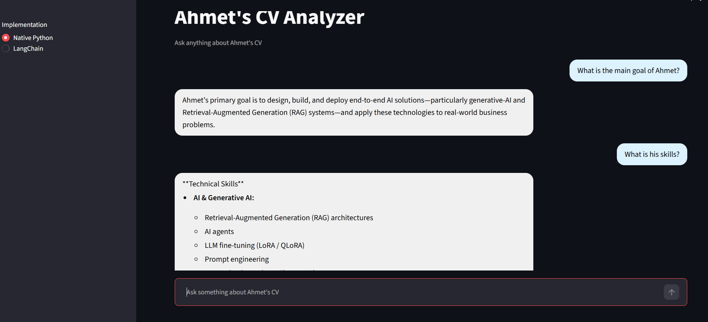

# Ahmet's CV Analyzer

<div align="center">
  
</div>


A practice project that demonstrates **Retrieval-Augmented Generation (RAG)** by building an AI assistant capable of answering questions about **Ahmet's CV**.

The application retrieves relevant information from the resume using vector search and generates context-aware responses with an LLM. It now features two different implementations: a **Native** approach using foundational libraries and a **LangChain** approach utilizing its ecosystem.

---

## Features

- Reads a PDF resume
- Splits the document into chunks
- Generates embeddings using HuggingFace / Sentence Transformers
- Stores embeddings in ChromaDB
- Retrieves the most relevant sections with semantic search
- Generates answers using an LLM (Groq via LiteLLM or ChatGroq)
- Interactive chat interface built with Streamlit allowing you to switch between implementations

---

## Tech Stack

- Python
- Streamlit
- ChromaDB
- Sentence Transformers & PyPDF
- LiteLLM
- LangChain Ecosystem (`langchain-groq`, `langchain-chroma`, `langchain-huggingface`, etc.)
- python-dotenv

---

## Project Structure

```text
.
├── app.py                      # Main Streamlit interface
├── cv.pdf                      # Resume used for the demo
├── requirements.txt            # Project dependencies
├── native_implement/           # Implementation using PyPDF, Sentence Transformers & LiteLLM
│   ├── ingest.py               # Creates native embeddings
│   └── answer.py               # Native retrieval and answer generation
├── langchain_implement/        # Implementation using LangChain Ecosystem
│   ├── ingest.py               # Creates embeddings via LangChain
│   └── answer.py               # LangChain retrieval and answer generation
├── native_chroma/              # Native ChromaDB vector database (Generated)
├── langchain_db/               # LangChain ChromaDB vector database (Generated)
└── README.md
```

---

## Installation

Clone the repository:

```bash
git clone https://github.com/ahmetcnrgl/ahmet-s_cv_analyzer.git
cd ahmet-s_cv_analyzer
```

Create a virtual environment and activate it:
```bash
python -m venv venv
# On Windows PowerShell
.\venv\Scripts\Activate.ps1
```

Install dependencies:

```bash
pip install -r requirements.txt
```

Create a `.env` file in the root directory:

```env
GROQ_API_KEY=your_api_key
```

---

## Usage

### 1. Generate Embeddings

Before using the app, you need to process the PDF and create the vector database. You can generate embeddings for either or both implementations:

**For Native Implementation:**
```bash
python native_implement/ingest.py
```

**For LangChain Implementation:**
```bash
python langchain_implement/ingest.py
```

### 2. Launch the Application

```bash
streamlit run app.py
```

Open the URL provided by Streamlit in your browser. You can use the sidebar to switch between the Native and LangChain implementations dynamically.

---

## Example Questions

- Tell me about Ahmet's education.
- What programming languages does Ahmet know?
- What AI technologies has Ahmet worked with?
- Does Ahmet have Flutter experience?
- Summarize Ahmet's projects.

---

## Purpose

This repository was created as a **learning project** to explore the fundamentals of **Retrieval-Augmented Generation (RAG)**, vector databases, semantic search, and LLM-powered question answering. 

The assistant is specifically designed to answer questions about **Ahmet's CV** and is intended for educational purposes rather than production use.

---

## Author
Ahmet Hamdi ÇINAROĞLU
